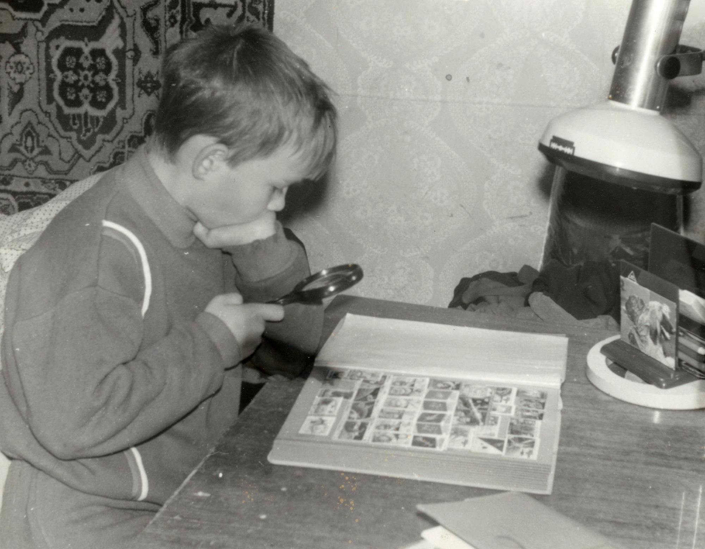

### Hi there

<!--
**d-ulitin/d-ulitin** is a ✨ _special_ ✨ repository because its `README.md` (this file) appears on your GitHub profile.

Here are some ideas to get you started:

- 🔭 I’m currently working on ...
- 🌱 I’m currently learning ...
- 👯 I’m looking to collaborate on ...
- 🤔 I’m looking for help with ...
- 💬 Ask me about ...
- 📫 How to reach me: ...
- 😄 Pronouns: ...
- ⚡ Fun fact: ...
-->

👋 Hello! I'm C++ developer 🔨, mechanical & electronic designer ⚡.

I'm using:
* C++ (gcc, clang)
* Windows/Linux

My pet-project is scanning old photos with a digital camera (digitization). My process of digitalization:
* build a stand, setup high-CRI light
* profile the camera with ColorChecher & dcamprof
* scan photos
* apply custom DCP profile
* dewarp image with [dewarp_chessboard](https://github.com/dm-u/dewarp_chessboard)
* make basic color correction
* upload & sent link to relatives to make them happy

